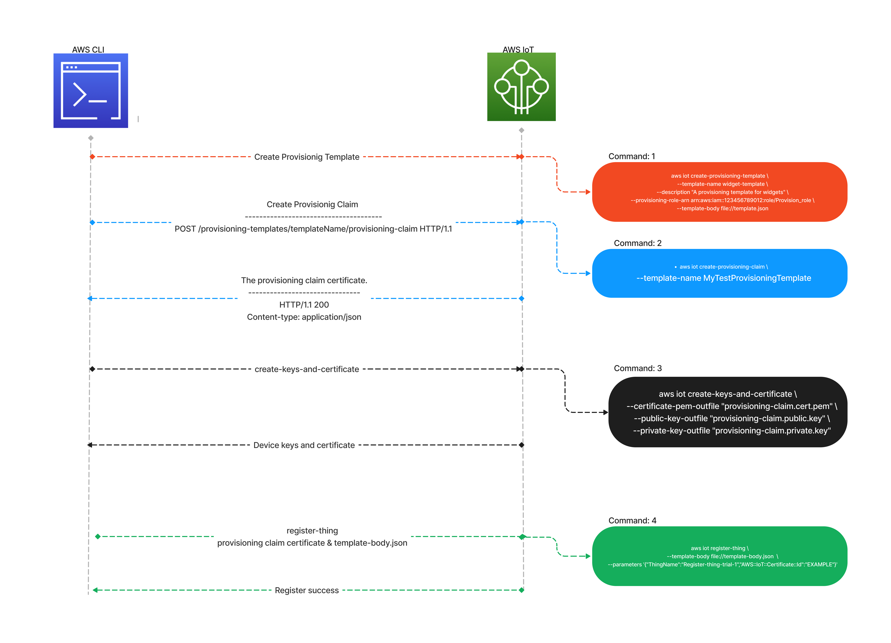

# ProvisionigByTursedUser
#### Başlarken 
Bu doküman  Provisionig by tursed user  prosedürünü kullanarak cihazları AWS IoT core'da nasıl sağlanabileceğini anlatacaktır. 


AWS iot geliştiricileri için cihazları otomatik olarak kaydetme metotları sunuyor.
Bu metotlardan biride ``` Provisioning by tursed user ```

Eğer cihazlarınızı üretim veya tedarik aşamasında aws iot'ye bağlamak için gerekli olan 
cihaza özel sertifikaları belirli kısıtlamalardan ötürü yükleyemiyorsanız, cihaz sertifikalarını güvenilir 
kullanıcılar aracılığıyla edinmeniz mümkün.

Provisionig by tursed user aşamaları şu şekildedir: 

**1)**  Cihaz son kullanıcıya geçmeden önce; 
- Cihaz sağlamak için gerekli rolleri ve policyleri oluşturmak 
- AWS hesabınızda cihazları belirli bir şablona göre sağlamak mümkün bunun için henüz cihazlarınız son kullanıcıyla buluşmadan önce AWS hesabınızda bir ``` Provisioning Template ``` oluşturmak. 


**2)** Cihaz son kullanıcıya geçtikten sonra; 
- Güvenilir kullanıcı veya bir teknisyen tarafından cihaz doğrulamak için istekte bulunmak 
- Doğrulama isteğiyle elde edilen geçici sertifikaları kullanarak cihazların bağlantı kuracağı uzun süreli asıl sertifikayi hesabınızın oluşturmasını sağlayacak istekte bulunmak 
- Asıl sertifikayi cihazlara yükleyerek cihaz sağlamasını tamamlamak 




### STEP-1: 

* Bir AWS hesabı oluşturun.
* Oluşturduğunuz AWS hesabına bir IAM user oluşturmak için [buradaya]( https://docs.aws.amazon.com/IAM/latest/UserGuide/getting-started_create-admin-group.html) tıklayın ve adımları izleyin

* Gerekli adımları tamamladıktan sonra AWS CLI'ı [buradaki](https://docs.aws.amazon.com/cli/latest/userguide/getting-started-install.html) adımları izleyerek kurabilirsiniz. AWC CLI yapılandırması için [buradaki](https://docs.aws.amazon.com/cli/latest/userguide/cli-configure-quickstart.html#cli-configure-quickstart-config) adımları izleyebilirsiniz. 

* IoT cihazları için gerekli rolleri oluşturmak için  [IAM console](https://console.aws.amazon.com/iam/home)'a gidin.
* Gezinme bölemsinden Roles'e tıklayın ve ardından create role'e tıklayın.
* Açılan pencereden varlık türü olarak AWS account'u seçin ve ardından rolü ekleyeceğiniz IAM user'ı seçin ve sonraki adıma geçin 
* AWSIoTThingRegistiration seçin ve rolünüze bir isim vererek rolü oluşturun 
* Oluşturduğunuz role girin "Add permission" sekmesinden "create inline policy" kısmını seçin.

```
{
    "Version": "2012-10-17",
    "Statement": [
        {
            "Action": [
                "iotsitewise:BatchPutAssetPropertyValue",
                "iotanalytics:BatchPutMessage",
                "iotevents:BatchPutMessage"
            ],
            "Resource": "*",
            "Effect": "Allow"
        }
    ]}
```


Json kısmını seçerek yukarıdaki policy'i oluşturduğunuz role ekleyin 
ve ardından aynı adımları izleyerek aşağıdaki policy'i rolünüze ekleyin
>_farklı policyler olarak oluşturmanızı öneririz_

```
{
    "Version": "2012-10-17",
    "Statement": [
        {
            "Effect": "Allow",
            "Action": "iot:CreateProvisioningClaim",
            "Resource": "arn:aws:iot:*:{accont_ID}:provisioningtemplate/*"
        }
    ]
}
```

* AWS `Provisioning by tursed user` için  cihazları sağlamak için gerekli rolleri ve AWS IAM user oluşturduğumuza göre artık gerekli yapılandırmaları yapmak için hazırız 

### Step-2  
* Son kullanıcı veya bir teknisyen cihazları konumlandırılmış yerinde sağlamak için bir mobil uygulama kullanırken cihazlar AWS IoT'ye ilk kez bağlanır 

> **UYARI** Bu prösedürü gerçekleştirmek için güvenilen kullanıcının erişimini ve iznini yönetmeniz gerekir. Bunu yapmanın bir yolu, güvenilir kullanıcının kimliğini doğrulayan ve bu prosedürü gerçekleştirmek için gereken AWS IoT özelliklerine ve API işlemlerine erişim sağlayan bir hesap sağlamak ve bu hesabı sürdürmektir.

* İlk olarak cihazları AWS IoT'ye kaydetmek üzere bir sağlama şablonu oluşturmanız gerekiyor. Bulunduğunuz dizinde  
```template-body.json``` adında bir dosya oluşturun ve aşağıdaki kodu json dosyası içerisine kaydedin. 
```
{
    "Parameters": {
      "ThingName": {
        "Type": "String"
      },
      "SerialNumber": {
        "Type": "String"
      },
      "Location": {
        "Type": "String",
        "Default": "WA"
      }
    },
    "Resources": {
      "thing": {
        "Type": "AWS::IoT::Thing",
        "Properties": {
          "ThingName": {
            "Ref": "ThingName"
          },
          "AttributePayload": {
            "version": "v1",
            "serialNumber": {
              "Ref": "SerialNumber"
            }
          }
        }
      },
      "certificate": {
        "Type": "AWS::IoT::Certificate",
        "Properties": {
          
            "CertificateId":{
                "Ref":"AWS::IoT::Certificate::Id"
             },
          "Status": "ACTIVE"
        }
      },
      "policy": {
        "Type": "AWS::IoT::Policy",
        "Properties": {
          "PolicyDocument":"{ \"Version\": \"2012-10-17\", \"Statement\": [{ \"Effect\": \"Allow\", \"Action\":[\"iot:*\"], \"Resource\": [\"*\"] }] }"
      }
    }
  }
}


```

 * AWS CLI da bu komutu çalıştırın. 
 #### command-1 
```
aws iot create-provisioning-template \
    --template-name  {Template_Name} \
    --description " {template_description}" \
    --provisioning-role-arn arn:aws:iam::123456789012:role/Provision_role \
    --template-body file://template.json
```
**Bu komutun çıktısını kaydedin** 

> Role ARN'ı oluşturduğunuz rolün bulunduğu sayfada göreblirsiniz 


*  Cevap olarak  şuna benzer bir şey görmelisiniz

#### RESPONSE
```
{
    "templateArn": "arn:aws:iot:{region}:{accont-id}:provisioningtemplate/{templateName}",
    "templateName": "{templateName}",
    "defaultVersionId": 1
}

``` 
* Şimdi oluşturduğumuz sağlama şablonunu kullanarak bir sağlama isteği gönderin
aşağıdaki kodla sağlama isteği gönderebilirisiniz 
 #### command-2
```
aws iot create-provisioning-claim \
    --template-name MyTestProvisioningTemplate
```
* Cevap olarak bizlere 5 dakika içerisinde sona erecek bir sertifika dönderecektir


#### RESPONSE
```
{
   "certificateId": "string",
   "certificatePem": "string",
   "keyPair": { 
      "PrivateKey": "string",
      "PublicKey": "string"
   }
   "expiration": number
}
```
> Unutmayın geçici sertifikalarınız AWS IoT Core'da sertifikalar kısmında gözükmez 

* Elde ettiğiniz geçici sertifikaları kaydedin. Ardından ```CreateKeysAndCertificate``` çağırarak asıl cihaz sertifikalarını edinin. Bunun için aşağıdaki komutu çalıştırın.
 #### command-3
```
aws iot create-keys-and-certificate \
    --certificate-pem-outfile "Test.cert.pem" \
    --public-key-outfile "Test.public.key" \
    --private-key-outfile "Test.private.key"
    
    

```
**RESPONSE**
```
{
    "certificateArn": "CERT_ARN",
    "certificateId": "CERT_ID",
    "certificatePem": 
                    " -----BEGIN CERTIFICATE-----
                             EXAMPLE_CERT
                      -----END CERTIFICATE-----\n",
                      
                      
    "keyPair": {
        "PublicKey": "-----BEGIN PUBLIC KEY-----
                              EXAMPLE_CERT
                      -----END PUBLIC KEY-----\n",
                      
        "PrivateKey": " -----BEGIN CERTIFICATE-----
                             EXAMPLE_CERT
                      -----END CERTIFICATE-----\n"
    }
}


```
* Asıl cihaz sertifikalarını kullanarak ```RegisterThing``` çağırın. Bunun için aşağıdaki komutu çalıştırın.
 #### command-4 
```

aws iot register-thing \
    --template-body file://template-body.json \
    --parameters '{"ThingName":"sample","SerialNumber":"433":,"AWS::IoT::Certificate::Id":"<certificate_ID>"}'
```

### RESPONSE
```
{
    "certificatePem": "-----BEGIN CERTIFICATE-----\n
                          Device_CERT
                      -----END CERTIFICATE-----\n",
    "resourceArns": {
        "certificate": "arn:aws:iot:REGİON:..........",
        "thing": "arn:aws:iot:REGION:...../tihng_name"
    }
}
```

* Artık sertifikanız kullanıma hazır! 


# Troubleshooting
register-thing'i çağırırken hata alırsanız gerekli parametreleri template-body.json dosyasına manuel olarak girip  ```aws iot register-thing --template-body file://template-body.json``` bu şekilde deneyin. 
